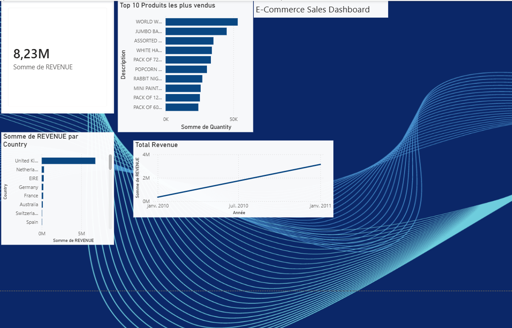

# E-commerce Sales Analysis 🛒

## Project Overview
Analysis of a real e-commerce dataset with 541,909 rows using SQL, Excel, and Power BI.

**Tools used:** PostgreSQL • Power BI • Excel  
**Dataset:** [E-commerce Data — Kaggle](https://www.kaggle.com/datasets/carrie1/ecommerce-data)  
**Author:** Mirabelle N'Guessan | Data Analyst & AI | Marketing Digital

---

## Business Questions Answered

- Which country generates the most revenue?
- What are the Top 10 best-selling products?
- What is the average basket in France?
- How many distinct orders were placed in France?

---

## Key Insights

| Metric | Result |
|---|---|
| Total Revenue | £8.23M |
| Top Market | United Kingdom (80% of revenue) |
| #1 Product | World War 2 Gliders (53,847 units) |
| France Average Basket | £23.07 |
| France Orders | 461 distinct orders |

---

## Dashboard Preview

---

## SQL Queries
See [analyse-ecommerce.sql](analyse-ecommerce.sql)

---

## Skills Demonstrated
- Data cleaning and preparation
- SQL queries (SELECT, WHERE, GROUP BY, ORDER BY, SUM, AVG, COUNT)
- Power BI dashboard creation
- Business insights extraction

---

## Connect with me
[LinkedIn](https://www.linkedin.com/in/mirabelle-nguessan)
